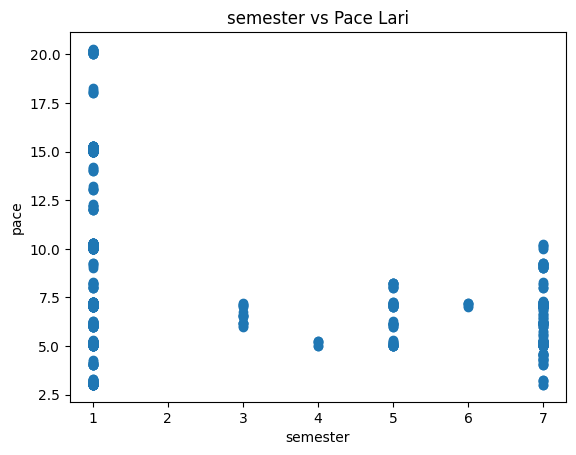
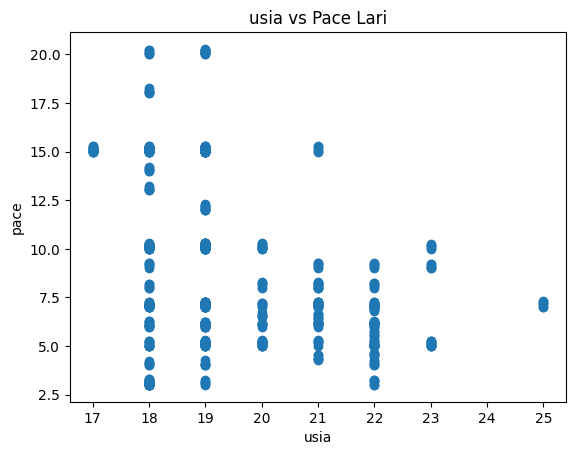
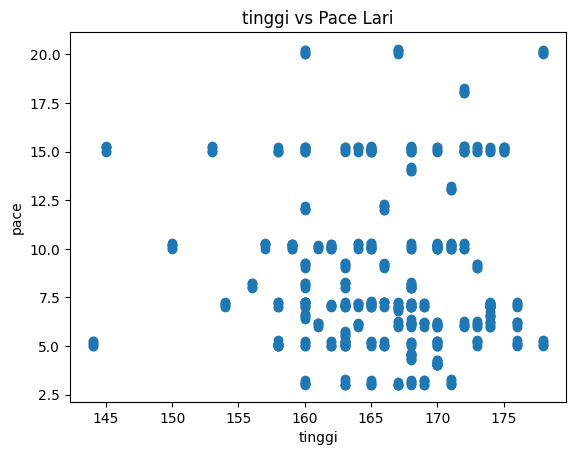
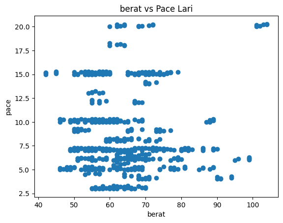
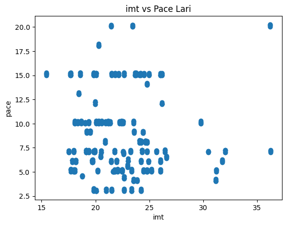
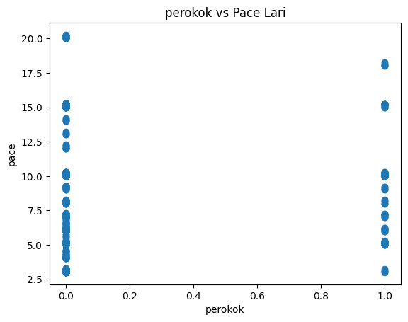

# Analisis Faktor-Faktor yang Mempengaruhi Pace Lari Menggunakan Random Forest

Repository ini berisi notebook dan hasil analisis untuk penelitian Analisis Faktor-Faktor yang Mempengaruhi Pace Lari Mahasiswa menggunakan metode Random Forest Regression dan Classification.  
Analisis dilakukan menggunakan Python dan Google Colab.

---

## 📌 Tujuan Penelitian
Penelitian ini bertujuan untuk:
- Menganalisis faktor-faktor yang mempengaruhi pace lari
- Memprediksi nilai pace lari (regresi)
- Mengklasifikasikan kategori pace (cepat / lambat)
- Mengetahui feature importance dari setiap variabel

---

## 📂 Struktur Repository

---

## 🧪 Dataset & Fitur
## [sampel data, klik disini untuk melihat](s%20-%20Copy.csv)
Dataset berjumlah 118 data yang berisi data mahasiswa dengan fitur:
- semester
- usia
- tinggi
- berat
- imt
- latihan_per_minggu
- perokok

Target:
- Regresi : pace
- Klasifikasi : kategori_pace (cepat / lambat)

---

## ⚙️ Metode yang Digunakan
- Data Cleaning & Preprocessing
- Feature Engineering (IMT)
- Data Augmentation
- Train-Test Split
- Random Forest Regressor
- Random Forest Classifier
- Evaluasi Model:
  - MAE
  - MSE
  - RMSE
  - R² Score
  - Accuracy & Classification Report

---

## 📊 Hasil Visualisasi

### 🔹 Diagram CRISP-DM

### 🔹 Scatter Plot Feature vs Pace  
         
### 🔹 Error Metrics

### 🔹 R² Score

### 🔹 Heatmap Feature Importance

---

## 🔍 Feature Importance & Analisis
Model Random Forest menunjukkan bahwa beberapa fitur seperti:
- Indeks Massa Tubuh (IMT)
- Tinggi
- Latihan perminggu
memiliki pengaruh signifikan terhadap pace lari.

Analisis dilakukan menggunakan:
- Feature Importance (MDI)
- Partial Dependence Plot (PDP)

---

## ▶️ Cara Menjalankan Notebook
1. Buka file sudrunner.ipynb
2. Jalankan menggunakan Google Colab
3. Upload dataset s.xlsx saat diminta
4. Jalankan cell secara berurutan dari atas ke bawah

---

## 🧑‍🎓 Catatan Akademik
Repository ini digunakan sebagai:
- Dokumentasi penelitian
- Pendukung skripsi
- Reproducibility analisis data

---

## 📎 Link Repository
Silakan akses repository ini melalui halaman utama GitHub:  
[👉 Klik nama repository di bagian atas halaman](running-pace-analyst-)  
[codingan lengkap pada notebook colab](sudrunner.ipynb)  

---

## ✍️ Penulis
Royhan Akbar  
Analisis Data & Machine Learning
